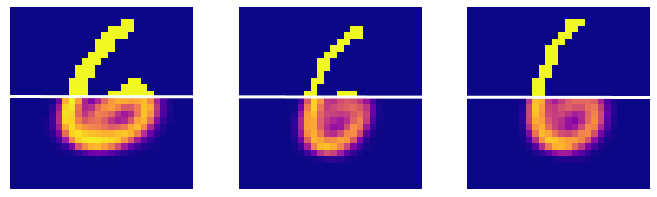

# Bayesian Bernoulli Mixture Modelling

## Introduction
Mixtures of multivariate Bernoulli distributions can be used to model binary random vectors.

Training in terms of maximum likelihood estimation is often performed by an expectation-maximisation
algorithm. In this research we consider a Bayesian hierarchical model, estimated using a Gibbs sampler.
Empirical results for the Bayesian approach are compared with a Bernoulli mixture model trained via
expectation-maximisation. These models are evaluated by comparing area under receiver operating
characteristic metrics on a handwritten-digit estimation task. Algorithms are derived so that models
can be meaningfully compared.

## Implementation

All code used for the research was written for Python 3.6, with the following dependencies:

* numpy == 1.16.2
* matplotlib == 2.2.2
* scipy == 1.2.1

The implementation for the Gibbs and EM models are in `gibbs.py`, and the implementation for AUROC metrics and 
label switching can be found in `metrics.py`. The remaining code was the code written to calculate estimates and plot
graphs for the report.